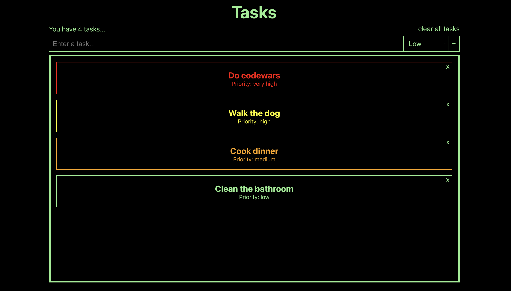

# Tasks

## Description

This is a quick little project to learn about React. It makes use of state and conditional formatting.

## Instructions

The app loads with a set of dummy tasks.

-   You can delete tasks using the x button or add using the + button.
-   Tasks are sorted and assigned a colour based on their priority.
-   You can assign the priority of a task using the drop down menu when adding a task.

**Note**: The app does not yet have persistent data storage so on reload the app will reset to the initial dummy tasks.

You can view and interact with the project at:
https://kris-martin.github.io/tasks/

## If you want to download and play with the code

This project was bootstrapped with [Create React App](https://github.com/facebook/create-react-app).

## Available Scripts

In the project directory, you can run:

### `npm start`

Runs the app in the development mode.\
Open [http://localhost:3000](http://localhost:3000) to view it in your browser.

The page will reload when you make changes.\
You may also see any lint errors in the console.

### `npm run build`

Builds the app for production to the `build` folder.\
It correctly bundles React in production mode and optimizes the build for the best performance.

The build is minified and the filenames include the hashes.\
Your app is ready to be deployed!

See the section about [deployment](https://facebook.github.io/create-react-app/docs/deployment) for more information.
